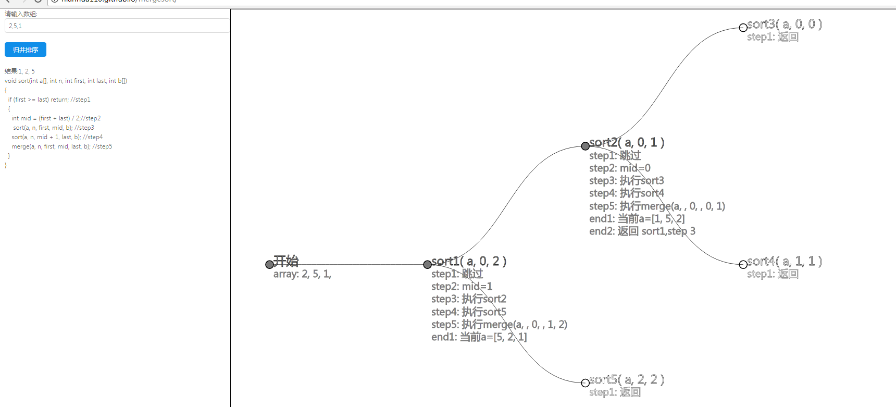

# merge-sort-call-tree-graph
# 实现归并排序的递归调用图
最近为了给一个学归并排序的同学搞懂递归调用的过程，在纸上画了整个递归调用的流程，及其每次调用传递的参数以及执行后的相应结果．
感觉非常适合教学使用，随用js自动画了个图，方便大家学习．
## 程序划分
虽然这个程序是js写成的，但是由于教学对象是学C的，所以贴的代码仍然是C的.
我们把归并排序的过程分为５步，在下面的注释中可以看到．
```c
 
void merge(int a[], int first, int mid, int last, int temp[])  
{  
    int i = first, j = mid + 1;  
    int m = mid,   n = last;  
    int k = 0;  
      
    while (i <= m && j <= n)  
    {  
        if (a[i] <= a[j])  
            temp[k++] = a[i++];  
        else  
            temp[k++] = a[j++];  
    }  
      
    while (i <= m)  
        temp[k++] = a[i++];  
      
    while (j <= n)  
        temp[k++] = a[j++];  
      
    for (i = 0; i < k; i++)  
        a[first + i] = temp[i];  
}  
void sort(int a[], int first, int last, int temp[])  
{  
    if (first < last)  return; //step1
     
        int mid = (first + last) / 2 //step2;  
        mergesort(a, first, mid, temp);    //step3  
        mergesort(a, mid + 1, last, temp); //step4 
        mergearray(a, first, mid, last, temp); //step5  
      
}
```

## 示列

[归并排序递归调用图](http://nianhua110.github.io/mergesort/)

##截图

